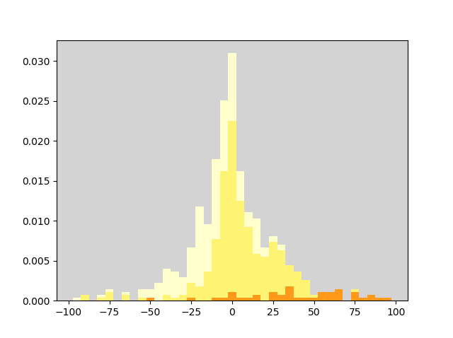

## Glazy Data Analysis

(Work in progress)
This project describes my attempts to use machine learning to understand the effect of chemical composition on the firing temperature of ceramic glazes. The dataset of glazes I'm using is taken from Glazy, an open-source database of glaze recipes. 

If you're impatient, here's a simplified version of the main result: I tried to predict the firing temperature of glazes based on their chemical compositions, and the predictions aren't particularly accurate. The chart below shows the given firing temperatures vs the predicted ones. 

[INSERT IMAGE]

This is a bit misleading, since some points overlap, so here's a histogram showing the distribution of errors (predicted - actual).

In an ideal world, the firing temperature would be a function of the chemical composition of a glaze, and with enough data we'd be able to approximate this function reasonably well. Unfortunately, things aren't so simple, for several reasons. The first is that the maturity of a glaze depends on the rate at which the temperature increases, not just the maximum temperature. But if we fix the rate of temperature rise, this isn't an issue. To be concrete, we'll assume the rate of temperature rise is 60C/hr, which allows us to convert Orton cones to temperatures. 

However, this still doesn't allow us to pin down a firing temperature based on the chemical composition. The materials that make up a recipe matter. Whether they are crystalline or glassy, have large or small particle sizes, can have an effect on how well melted a glaze is at a given temperature. So we'll have to accept some variability based on the materials used.

Another source of variability is that the atmosphere of the kiln can have an effect, particularly for glazes high in iron. While there is the option to indicate the firing atmosphere of glazes in Glazy, these are not consistently filled in, so I've decided not to try control this source of variability, at least for now. 

A further problem is that the temperature at which a glaze is considered mature can be quite subjective. A given glaze might be deemed satisfactory over a fairly large range of temperatures, depending on what effects the potter is looking for. To reduce the amount of variability, I've excluded glazes that are far from completely melted. Even so, some glazes are well-melted and stable over a relatively wide temperature range. In Glazy, there are fields to indicate the lower and upper cones to which a glaze can be fired to, so in principle one could try predict these bounds. However, since many entries simply list a single temperature (whatever the potter using the glaze fires to), I've decided to simply predict the midpoint of this range. Of course, the temperature listed might not be the midpoint. 

...

Problems with the dataset:

Some errors (eg cone 08 vs cone 8), some glazes that are underfired, materials whose analyses differ significantly from their theoretical analyses (Colemanite), glazes with cone info missing.

Non-uniform distribution of firing temperatures.

[INSERT HISTOGRAM]

A big issue with this dataset is that there are many duplicates and slight variants. If these are not dealt with, the test set will overlap with the training set, and this will artificially decrease the test error. While the duplicates are easy to identify, the slight variants pose a substantial challenge.
 
I've only posted the result of a clustering algorithm (K-means), followed by manually verifying that the glazes in each cluster do have a common origin, and that separate clusters aren't related, and splitting or combining them as necessary. The manual verification process is incomplete, however. I've posted the verified clusters here: 

https://pietermostert.github.io/glazy-data-analysis/html/verified-clusters.html,

and the unverified ones here:

https://pietermostert.github.io/glazy-data-analysis/html/unverified-clusters.html
