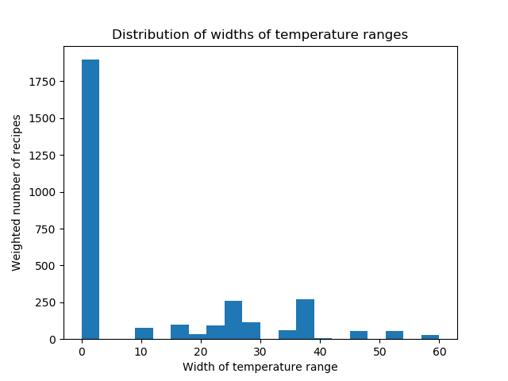

# Glazy Data Analysis

(Work in progress)

## Introduction

This project describes my attempts to use machine learning to understand the effect of chemical composition on the firing temperature of ceramic glazes. The dataset of glazes I'm using is taken from [Glazy](https://glazy.org), an open-source database of glaze recipes. 

The recipes in Glazy come mostly from collections put together by American potters since the 1970s, although many of them probably originate much earlier, in China, Korea, and Japan. They therefore reflect an aesthetic (or rather, several groups of aesthetics) that is not representative of all glazes ever made, or of all potential glazes. A model that is good at predicting the firing temperatures of glazes in this collection is of limited use, since recipes coming from the same population most likely already have an established firing temperature. On the other hand, test recipes created by randomly choosing ingredients generate a different distribution, so one can't say anything about the accuracy of the model when applied to such recipes.

To illustrate this, I've shown the distribution of firing temperatures below (restricted to 1050C and above - the ones below 1050C make up only 1.2% of the total)

The peaks around 1220C and 1280C reflect the fact that these are the conventional firing temperatures for mid and high fire glazes among Western modern-day potters. One would expect the distribution of firing temperatures of glazes created by randomly constructing recipes to be much more spread out.

However, there are at least two situations where a model can be useful:

1. A model can be used to flag recipes in the collection that may be recorded incorrectly. In fact, I've already found a number of incorrect records by examining glazes whose stated firing temperature differs wildly from the predicted one. Alternatively, if the predicted temperature is significantly higher than the listed one, this may a sign that the glaze isn't fully mature, and may therefore be less durable. A glaze whose predicted temperature is significantly lower than the listed one may be very fluid at the listed temperature.

2. If we have a model that gives predictions together with confidence intervals, we can say something meaningful about independently created test glazes. This is still a work in progress. I've looked at using a Gaussian process model, but it's not immediately clear how best to take into account the fact that glazes occur in groups (more on this below). Another issue is that the training time scales cubically with the number of recipes, so if Glazy expands substantially, this approach may become infeasable. There may be other approaches that can be tackled using Tensorflow's probability library, but I haven't looked into this yet. 

As a temporary stand-in for a model with confidence intervals, I've plotted the density of data points alongside the predictions to give some indication of how much confidence to place in them. For example, the first plot below shows the predictions for a family of glazes where only the proportions of Silica and Alumina are varied. Below it is a plot of the density. The predictions in the regions of high density are in line with conventional wisdom (see Daniel de Montmollin's fusion diagrams).

In an ideal world, the firing temperature would be a function of the chemical composition of a glaze, and with enough data we'd be able to approximate this function reasonably well. Unfortunately, things aren't so simple, for several reasons. The first is that the maturity of a glaze also depends not only on the maximum temperature, but also on the rate at which the temperature increases. For this reason, [pyrometric cones](https://en.wikipedia.org/wiki/Pyrometric_cone) are used instead of temperatures. However, for a fixed rate of temperature rise, a pyrometric cone will bend at a pre-determined temperature. The glazes in Glazy are described in terms of Orton cones, and I've used the [chart](https://www.ortonceramic.com/files/2676/File/Orton-Cone-Chart-C-022-14-2016) published by Orton, with a 60C/hr rate of temperature rise to map from Orton cones (regular, self-supporting) to temperatures. We'll continue to refer to the firing temperature of a glaze, with the understanding that this implicitly refers to its Orton cone under the inverse of this mapping.

A complication that we can't overcome is that the oxide composition doesn't tell the whole story; the materials that make up a recipe matter. Whether they are crystalline or glassy, have large or small particle sizes, can have an effect on how well melted a glaze is at a given temperature. So we'll have to accept some variability based on the materials used. 

The accuracy of a glaze's oxide composition depends on the accuracies of oxide compositions of its ingredients, and often these are not known exactly. The composition of materials such as Colemanite and wood ash may differ significantly from the compositions listed in Glazy. These are relatively uncommon glaze ingredients, so hopefully the error resulting from incorrect analyses has only a small effect on the model. Feldspars are more common, and while their composition also differs from that of pure potash or soda feldspar, this variation isn't as pronounced as it is for Colemanite and wood ash.

Another source of variability is that the atmosphere of the kiln can have an effect on the firing temperature, particularly for glazes high in iron. While there is the option to indicate the firing atmosphere of glazes in Glazy, these are not consistently filled in, so I've decided not to try control this source of variability, at least for now. 

A further problem is that the temperature at which a glaze is considered mature can be quite subjective. A given glaze might be deemed satisfactory over a fairly large range of temperatures, depending on what effects the potter is looking for. To reduce the amount of variability, I've excluded glazes that are obviously not completely melted. Even so, some glazes are well-melted and stable over a relatively wide temperature range. In Glazy, there are fields to indicate the lower and upper cones to which a glaze can be fired to, so in principle one could try predict these bounds. However, since many entries (over 60%) simply list a single temperature (whatever the potter using the glaze fires to), I've decided to simply predict the midpoint of this range. Of course, the temperature listed might not be the midpoint. The histogram below shows the distribution of the widths of the firing ranges, as recorded in Glazy.

If we could determine, for each oxide composition, the range of temperatures at which a glaze is fully melted, smooth, and hasn't run off the pot, we could take the midpoint of this range, and use this to define an average firing temperature as a function of the oxide composition (ignoring the effects of material properties and atmosphere for the moment). We'd expect this function to vary relatively smoothly, for the most part, although there will be points where eutectic troughs give rise to sharp local minima. We'd expect the average firing temperatures we obtain from the Glazy data, by contrast, to deviate from this function in a relatively unpredictable manner, since this depends on the personal aesthetics and circumstances of the potters who've contributed to the database. 

The following diagram attempts to illustrate the situation. Here the oxide composition has been reduced to one dimension, for simplicity. The grey band represents the range of acceptable firing temperatures, and the red dots represent glazes. 

The green line below shows the average firing temperature, based on the acceptable range. 

However, it's unlikely one can find this curve based on the glazes in the dataset alone. Models that fit the data reasonably well will tend to level off around 1222C and 1285C, (cones 6 and 10), since most glazes in the database are close to one of these temperatures. 

A more rigid model may give a better approximation to the green curve, but the challenge is in quantifying how good this approximation is.

## Problems with the dataset:

A big issue with this dataset is that there are many duplicates and slight variants. If these are not dealt with, the test set will overlap with the training set, and this will artificially decrease the test error, and encourage overfitting. While the duplicates are easy to identify, the slight variants pose a substantial challenge.
 
I decided to deal with this problem by grouping glazes that derive from a common origin, and weighting each glaze in a group of size n by 1/n. It's not clear what the best way of grouping glazes is, but I decided to place glaze recipes A and B in the same group if at least one of the following cases holds:

* Percentages of materials in recipes A and B differ by small amounts.

* Recipe A is the same as recipe B, except that one or more materials have been replaced by similar ones (for example, Custer Feldspar with G-200 Feldspar).

* Recipe A is a reformulation, with different materials, of recipe B.

* Recipe A is recipe B plus colouring/opacifying oxides.  

* Recipe A and B form part of the same biaxial test.

Note that in the last two conditions, the oxide compositions may differ considerably. 

To group the glazes, I used the K-means clustering algorithm to identify potential groups, and then examined them on a case-by-case basis to see if they should be split or combined with other groups, based on the conditions above. This is a painstaking process that involves looking up the recipes on Glazy. There's a fair amount of ambiguity involved, and I've had a make a number of judgement calls. Fortunately Glazy gives a list of recipes with the same base, which helps with the second last case. 

I still haven't finished going through the potential groups manually, but I've processed just over 75% of them. The ones I've checked can be found [here](https://pietermostert.github.io/glazy-data-analysis/glazy_clusters_checked.json), and the rest [here](https://pietermostert.github.io/glazy-data-analysis/glazy_clusters_unchecked.json).

When splitting recipes into training, validation and test sets, the splits are made on the level of groups, so recipes from the same group don't appear in both the training and test sets, for example. 

A number of oxides are only present in non-trivial amounts in a minority of glazes, which makes it unlikely that their effect on the firing temperature will be visible in the data. The chart below shows the weighted percent of glazes that contain more than 0.5 percent mole of the oxides listed.

## Data cleaning

A modified copy of the dataset can be found [here](https://pietermostert.github.io/glazy-data-analysis/GlazyRecipes.csv). Modifications are restricted to changing the cones for several glazes, based on information found in the notes (which can be found on Glazy, but are not included in the CSV file). Several glazes were listed as being cone 08, for example, when they should be cone 8. I've recorded the glazes changed as comments in [recipe_processing_1](https://pietermostert.github.io/glazy-data-analysis/recipe_processing_1.py). 

For glazes where only the lower cone was indicated, I set the upper cone equal to the lower cone (and vice versa). Glazes which had neither upper nor lower cone indicated were removed. 
I removed recipes containing rare earth elements (there were only 3 in the database snapshot I used, but there are more now). I removed Egyptian paste recipes, which are misclassified under glazes, as well as two series of sculptural glazes. 

I decided to exclude 'speciality' glazes, so removed crawl and crater glazes, and any others where the notes indicated a textured surface, or that they were sculptural. Glazes with Silica : Alumina ratios outside the range 4 - 20 were also removed, which should account for all zinc-silicate macro-crystalline glazes. Since glazes with low Silica relative to the fluxes tend to not be durable, glazes with Silica : flux ratios below 1.8 were removed. This should account for many ash glazes. I haven't specifically removed Shinos, although perhaps I should.

Certain compounds can be toxic to be potter and/or end-user, so are not frequently found. For this reason glazes containing Lead, Cadmium, Fluorine, Vanadium Pentoxide and Bismuth Subnitrate were removed.

Glazes that were marked as untested were removed, as well as glazes described as underfired. A few glazes which had photos that showed a clearly unmelted glaze, were also removed. These glazes were found by searching Glazy for keywords, as well as by examining glazes whose listed temperature was much lower than the predicted firing temperature, based on initial models. The glazes excluded are listed in recipe_processing_1, together with reasons for their exclusion. 

It appears that glazes high in Alumina and Boron tend to have fairly wide firing ranges. As an extreme example, [Purdy and Fox](https://www.ideals.illinois.edu/handle/2142/13255) describe a test glaze successfully fired from cone 010 to 10 (though it does contain Lead). This makes predictions of the average firing temperature both more difficult and less useful, so glazes with Boron over 0.8 UMF were excluded.

I decided not to automate the removal of outliers. However, I used an isolation forest to identify outliers, and examined these individually. This turned up a couple of recipes where an ingredient was missing its oxide analysis. 

## Which metrics to use / format of data

There are several ways to represent the composition of oxides in a glaze. It may appear that the most natural way is by giving the percentage of each oxide by weight. However, from a chemistry viewpoint, a more natural way is to consider the percentages of the numbers of molecules of each oxide, or 'molar percent'. A third way, introduced by Herman Seger in his study of glazes, is to take the molar percentages and divide them by the sum of the flux molar percentages. This is known as the unity molecular formula, or UMF. I haven't found that any one of these is unequivocally better than the rest. 